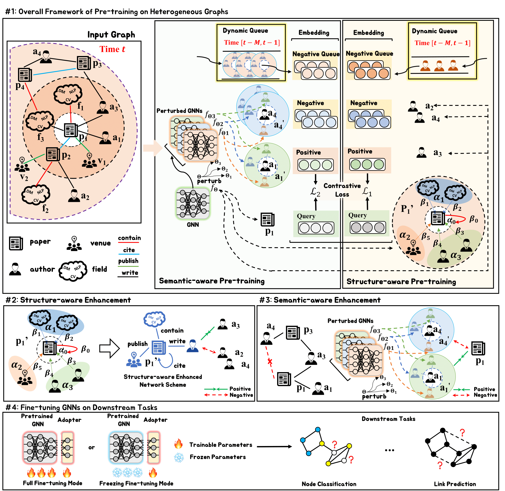

## PHE: Structure and Semantic Enhanced Pre-training of Graph Neural Networks for Large-Scale Heterogeneous Graphs

 

This is the Pytorch implementation for our *TKDD'25* paper: [**PHE: Structure and Semantic Enhanced Pre-training of Graph Neural Networks for Large-Scale Heterogeneous Graphs**](https://arxiv.org/abs/2501.08001). 

## Abstract

In recent years, graph neural networks (GNNs) have facilitated the development of graph data mining. However, training GNNs requires sufficient labeled task-specific data, which is expensive and sometimes unavailable. To be less dependent on labeled data, recent studies propose to pre-train GNNs in a self-supervised manner and then apply the pre-trained GNNs to downstream tasks with limited labeled data. However, most existing methods are designed solely for homogeneous graphs (real-world graphs are mostly heterogeneous) and do not consider semantic mismatch (the semantic difference between the original data and the ideal data containing more transferable semantic information). In this paper, we propose an effective framework to pre-train GNNs on the large-scale heterogeneous graph. We first design a structure-aware pre-training task, which aims to capture structural properties in heterogeneous graphs. Then,  we design a semantic-aware pre-training task to tackle the mismatch. Specifically, we construct a perturbation subspace composed of semantic neighbors to help deal with the semantic mismatch. Semantic neighbors make the model focus more on the general knowledge in the semantic space, which in turn assists the model in learning knowledge with better transferability. Finally, extensive experiments are conducted on real-world large-scale heterogeneous graphs to demonstrate the superiority of the proposed method over state-of-the-art baselines. The overall framework is as follows:

 
 

